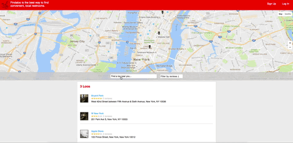

# Findaloo

[Visit Findaloo][live]

[live]: http://findaloo.herokuapp.com/#/?_k=9qe23h

Findaloo is a Yelp-inspired web application designed to help New Yorkers
find free and convenient restrooms in their local neighborhoods.
The backend is built using Ruby on Rails on a PostgreSQL database, and
the frontend employs React within the Redux framework.

## Features & Implementation

Findaloo is a single-page application, dynamically updating without constant
reloads. Upon first rendering, both authenticated and non-authenticated users
are brought to the index page of "loos" (i.e. restrooms) on the default map.

## Map

A central feature of Findaloo is the index page's map. With the deep integration
of the Google Maps API, Findaloo has been able to enhance its geolocation
functionality. For example, the loos that are shown on the index page are
filtered by the bounds of the map (among other parameters). Other uses of the
Google Maps API autocomplete searching and adding a loo by clicking the location
on the map. In addition, Findaloo integrates Google Maps StreetView API
to seed the database with authentic pictures at each location.

## Filtering

In addition to filtering by the bounds of the map, users can also
filter the loos on the index page by their average review ratings.
Forgoing the need to create additional columns on the loos table,
I've created class methods on the loo model which query the database to
perform this filter.

## Reviews

Reviews are displayed with the current users' review at the top of the
page, and then all other user reviews following after. If the user
does not have a review, he/she are prompted to create a review for this
loo. If the user is not signed in, they will be prompted to sign in to
review this loo. To implement this, I separated out current user review
and other reviews into separate variables in the Loo controller so that
the loo show component can render them appropriately.

In addition to reviewing individual user reviews, by adding methods to the Loo model,
users can also retrieve aggregate data regarding average rating and number of reviews for each loo.
With Google Maps API's built-in infoWindow, this relevant information appears
when users click on an icon.

##User authentication

To authenticate users without storing their password, I implemented
BCrypt encryption to store an encrypted-version of the password. In addition,
I bootstrapped the current user alongside my HTML to ensure that the app
knows who the current user at all times.

## Forthcoming

* Users will be able to create a profile
* Users will be able to sign up with Google or Facebook
* Users will be able to filter by number of reviews
